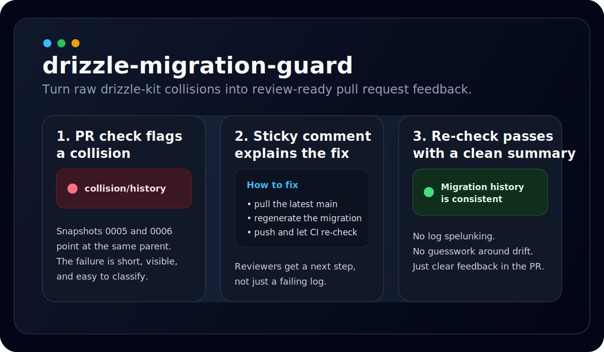

# drizzle-migration-guard


[](https://github.com/saudademjj/drizzle-migration-guard/actions/workflows/drizzle-migration-guard-ci.yml)
[](https://github.com/saudademjj/drizzle-migration-guard)

A GitHub Action that explains Drizzle migration collisions in pull requests.



`drizzle-migration-guard` wraps `drizzle-kit check`, turns raw failures into a short diagnosis, and leaves a sticky PR comment with concrete next steps when your migration history collides.

## Why this exists

Drizzle already ships `drizzle-kit check`, but the default output still makes reviewers jump between logs, local repro steps, and migration snapshots. This action adds the experience layer:

- Auto-detects `drizzle.config.ts` in the working directory.
- Skips itself when the PR does not touch Drizzle config, schema, or migration files.
- Normalizes failures into `collision/history`, `config/dependency`, or `unknown`.
- Writes a GitHub Actions summary and a sticky PR comment with a fix recipe.
- Blocks the PR only for `collision/history` by default.

## Quick start

```yaml
name: drizzle-migration-guard

on:
  pull_request:
    paths:
      - "drizzle.config.ts"
      - "src/db/**"
      - "drizzle/**"
      - "package.json"
      - "package-lock.json"

jobs:
  guard:
    runs-on: ubuntu-latest
    steps:
      - uses: actions/checkout@v4

      - uses: actions/setup-node@v4
        with:
          node-version: 20
          cache: npm

      - run: npm ci

      - uses: saudademjj/drizzle-migration-guard@main
        with:
          github-token: ${{ github.token }}
```

## Inputs

| Input | Default | Notes |
| --- | --- | --- |
| `config` | empty | Comma or newline separated config paths or glob patterns. Use this for multi-package repos. |
| `working-directory` | `.` | Directory where `drizzle-kit check` runs. |
| `fail-on` | `collision` | `collision`, `all`, or `none`. |
| `comment-mode` | `sticky` | `sticky` or `off`. |
| `github-token` | empty | Used to read PR files and update the sticky comment. |
| `timeout-seconds` | `60` | Timeout for `drizzle-kit check` (seconds). |

## Outputs

| Output | Meaning |
| --- | --- |
| `status` | `success`, `failure`, or `skipped` |
| `summary` | One-line job summary |
| `report-path` | Absolute path to the generated markdown report |

## Behavior notes

- Default discovery only checks the first root-level `drizzle.config.*` file it finds.
- Multi-config support is explicit by design. Pass config paths through the `config` input.
- The action expects `drizzle-kit` to be available in the checked-out project. It calls `npx --no-install drizzle-kit check`.
- Non-blocking failures still appear in the step summary and comment, but only `collision/history` fails the job by default.

## Local development

```bash
npm install
npm run build
npm test
```

## 中文说明

`drizzle-migration-guard` 是一个面向 Pull Request 的 GitHub Action。它不是替代 Drizzle，而是把 `drizzle-kit check` 包装成团队更容易看懂的反馈层。

它会做这些事：

- 在 `working-directory` 下自动寻找 `drizzle.config.ts`
- 只在 PR 改到了 Drizzle 相关文件时才执行
- 把错误归类成 `collision/history`、`config/dependency`、`unknown`
- 把结果写进 Actions summary
- 在 PR 里维护一条 sticky comment，直接告诉你下一步怎么修

默认修复路径也尽量简单：

1. 拉取最新主分支并 rebase 或 merge。
2. 重新运行 `npx drizzle-kit generate --config <your-config>`。
3. 提交新的 migration，再次推送，等待 Action 复检。

## License

MIT
